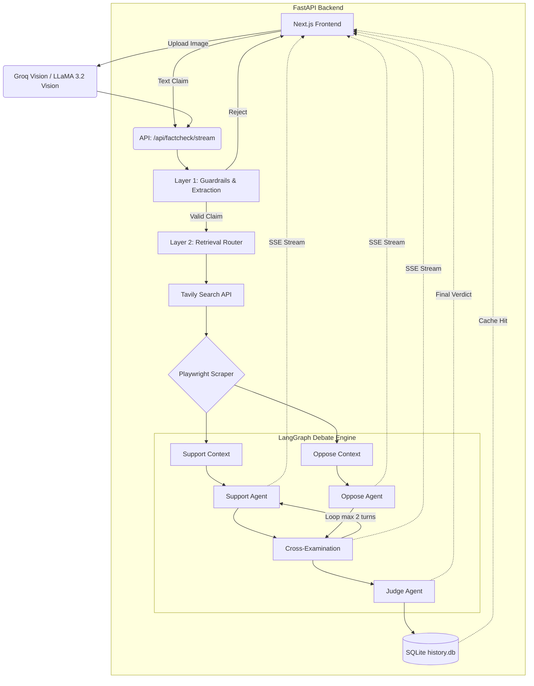

# Fact Check Agent Architecture (V2)

This document provides a detailed overview of the system architecture, data flow, and components of the Multi-Agent Fact Check Debate Engine.

## System Diagram

The system operates across a robust FastAPI backend connected to a Next.js frontend, utilizing LangGraph for autonomous agent state management.

## Layers Breakdown

### Layer 0: API Security & Rate Limiting (`api.py`)
- **Rate Limiting**: Integrated `slowapi` to enforce IP-based rate limiting (e.g. 5 requests/minute for streaming endpoints) to prevent API abuse and protect LLM token quotas.
- **Input Sanitization**: All incoming claims are passed through a `sanitize_claim` middleware to strip HTML tags and detect malicious prompt injection attempts (e.g. "ignore all previous instructions").

### Layer 1: Extraction & Guardrails (`layer_extractor.py`)
- **Multi-Modal Support**: Uses `llama-3.2-90b-vision-preview` to extract textual claims from uploaded screenshots or images.
- **Guardrails**: Uses Groq `openai/gpt-oss-120b` with `instructor` in JSON mode to evaluate if the claim falls within verifiable domains (Science, Health, Public figures).
- **Atomic Extraction**: Breaks down complex user sentences into singular, verifiable "Atomic Claims".

### Layer 2: Retrieval Router (`retrieval_router.py`)
- **Dual Retrieval**: Runs two independent queries per atomic claim:
  1. *Proving Query*: Searches for evidence that confirms the claim.
  2. *Disproving Query*: Searches for evidence that refutes the claim.
- **Tavily & Playwright**: Uses Tavily for deep web search, and spawns headless Chromium instances via Playwright to scrape the full text of articles, bypassing JS-blocks.

### Layer 3: Debate Engine (`agents.py` & `graph.py`)
- **State Management**: Built on `langgraph`. Tracks the `DebateState` TypedDict which holds the contexts, agent cases, and cross-examination history.
- **Support & Oppose Agents**: Powered by `ChatGroq` (`openai/gpt-oss-120b`). They are strictly prompted to cite their sources using `[1]`, `[2]` inline references mapped to the retrieved URLs. They execute in **parallel** and await each other before proceeding to the rebuttal phase.
- **Real-Time Streaming**: The backend utilizes `sse-starlette` and LangGraph's `astream_events` to intercept language model tokens and push them to the Next.js UI in real-time.
- **Impartial Judge**: Uses `openai/gpt-oss-120b` with native Instructor Structured Outputs (JSON mode) to review the final debate history and return a strictly typed `JudgeVerdict` Pydantic model (True, False, Misleading, Unverifiable).

## Data Persistence (`database.py` & `models.py`)
- Uses SQLAlchemy and SQLite (`history.db`) to cache results.
- **Cache Hit**: If a user submits a claim that exactly matches a previously processed `original_claim`, the FastAPI endpoint immediately returns the complete cached debate from SQLite, saving API tokens and returning instantly.
