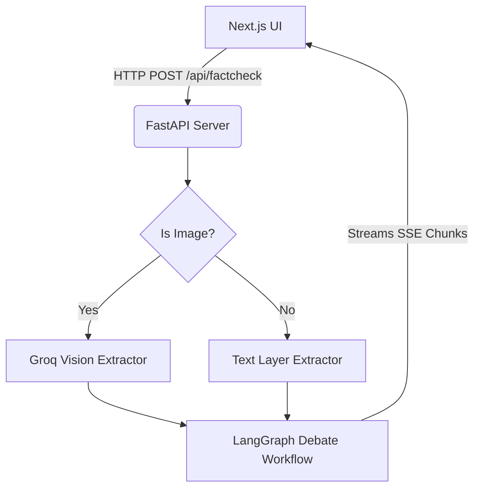
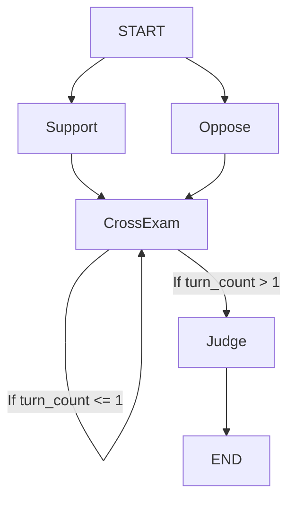

# 🏛️ System Architecture

This document breaks down the high-level architecture, module flow, and database design of the Fact-Check Agent.

## 1. High-Level Overview

The system follows a classic decoupled client-server architecture:
- **Client (Frontend)**: A Next.js application that captures user inputs (text or images) and displays real-time updates using Server-Sent Events (SSE).
- **Server (Backend)**: A FastAPI application that serves endpoints, processes images, and runs a LangGraph workflow. It uses Groq for LLM inference and Tavily/Playwright for web research.

## 2. The LangGraph Workflow (`backend/graph.py`)

The heart of the application is a State Graph (LangGraph) that passes a `DebateState` dictionary between different AI nodes.

### The Nodes:
1. **Support Agent (`support_agent_node`)**: 
   - Receives the claim.
   - Triggers `retrieval_router` to search Tavily for proving evidence.
   - Drafts an initial case in favor of the claim.
2. **Oppose Agent (`oppose_agent_node`)**: 
   - Operates in parallel to the Support Agent.
   - Searches Tavily for debunking evidence.
   - Drafts an initial case against the claim.
3. **Cross-Examination (`cross_examination_node`)**: 
   - A sequential node that runs *after* both initial cases are drafted.
   - The Support Agent reads the Oppose case and writes a rebuttal.
   - The Oppose Agent reads the Support case and writes a rebuttal.
   - Increments a `turn_count` in the state.
4. **Judge Agent (`judge_agent_node`)**: 
   - Reads the entire transcript (Cases + Rebuttals).
   - Generates a final JSON object (`JudgeVerdict`) using Instructor.

## 3. Web Scraping Engine (`backend/browser_tool.py`)

Standard LLM web search tools often only return short 150-character snippets from Google/Tavily. To deeply fact-check a claim, the agents need the full article context.
- We use **Playwright** (`sync_playwright`) to launch a headless Chromium browser.
- The browser visits the URL, waits for the DOM to load (bypassing simple JavaScript walls), and extracts the HTML.
- **BeautifulSoup** parses the HTML, strips out `<script>`, `<style>`, and `<nav>` tags, and extracts the raw readable text.
- The text is truncated to ~8000 characters to fit within the LLM context window.

## 4. Database Schema (`backend/models.py`)

The system stores historical fact-checks in a local SQLite database (`history.db`) via SQLAlchemy.

**Table: `fact_checks`**
| Column | Type | Description |
|--------|------|-------------|
| `id` | Integer | Primary Key |
| `original_claim` | String | What the user originally typed |
| `extracted_claim` | String | The normalized claim processed by Layer 1 |
| `status` | String | Current graph state (e.g., COMPLETED) |
| `support_case` | Text | Transcript of the Support agent |
| `oppose_case` | Text | Transcript of the Oppose agent |
| `support_rebuttal`| Text | Transcript of the Support rebuttal |
| `oppose_rebuttal` | Text | Transcript of the Oppose rebuttal |
| `verdict` | String | "True", "False", or "Unverified" |
| `confidence` | Float | 0.0 to 100.0 |
| `summary` | Text | Final explanation from the Judge |
| `citations_json` | Text | Stringified JSON array of URLs used |
| `created_at` | DateTime | Timestamp |
